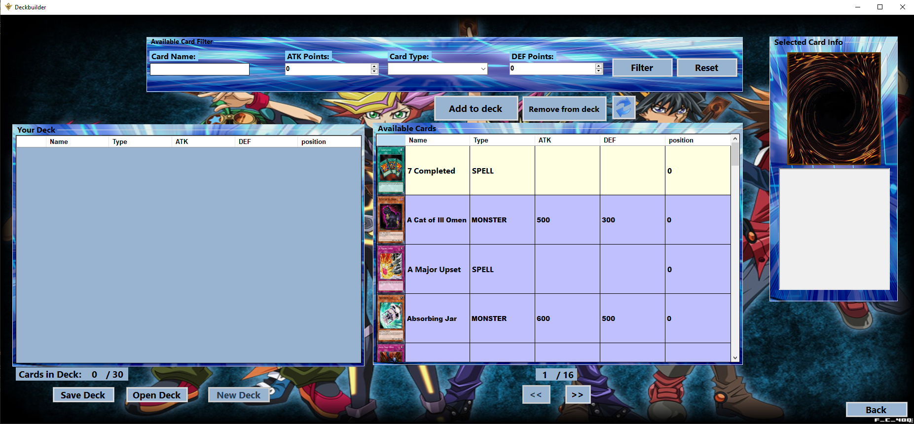
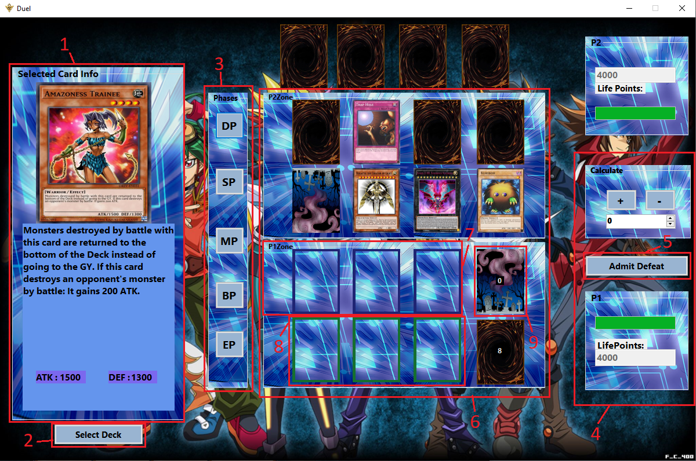
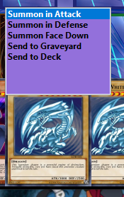
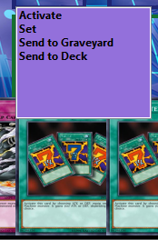
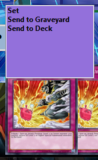

# Yu-Gi-Oh card game

# 1.Краток опис на проектот

Нашиот тим работеше на креирање на Yu-Gi-Oh игра која ќе ја емулира друштвената игра со карти со исто име. Апликацијата е инспирирана од  веб-апликацијата https://www.duelingbook.com/. Играта му овозможува на корисникот да се регистрира и најави на свој профил, да создаде свој шпил од карти кои ги одбира од датабаза на карти, да го зачува тој шпил локално и да може да го користи за да игра против други играчи локално и онлајн.

# 2.Како се игра

## 2.1 Регистрирање и логирање
За да може корисникот да ја пристапи играта потребно е прво да се регистрира и потоа да се логира. Информациите за профилот се чуваат на сервер.

## 2.2 Креирање на шпил карти
За да може корисникот да игра, најпрво е потребно да направи свој шпил од карти. Тоа се постигнува со формата за deck builder.

Во оваа форма има **2 DataGridView табели**, една за **шпилот карти** а другата за **сите достапни карти**. Корисникот може да додаде карти по свој избор со селектирање на карта од DataGridView-от за достапни карти и притискање на **копчето “Add to deck”**. Можат само максимум 3 инстанци од една иста карта да се додадат во шпилот. За полесно наоѓање на било која специфична карта  корисникот може да го искористи **полето “Available Card Filter”**, каде што може да пребарува било која карта според сите дадени карактеристики за таа спесифична карта. Откако корисникот ќе избере шпил од максимум 30 карти може да го зачува тој шпил со пристискање на **копчето “Save Deck”**. Тој шпил притоа се зачувува како JSON објект. Со пристискање на **копчето “Open Deck”** може да се избере било кој  претходно направен шпил карти, а притоа за полесно наоѓање на тој зачуван шпил, сите шпилови можат да се зачувуваат и филтрираат со екстензијата .ygo. **“Save Deck” и “Open Deck”** прават серијализација во и десеријализација од **JSON** објект. Ако корисникот сака да креира дополнително нов шпил може да го направи тоа со притискање на копчето **“New Deck”**, со што при притискање **“Yes”** на MessageBox, ќе го испразни **DataGridView-от за шпилот**. При клик на било кој елемент од двата DataGridView од десна страна се прикажува сликата на картата и опис на нејзините ефекти. 

# 2.3 Играње на играта

***Напомена: За да може да се игра потребно е да се креира барем еден шпил карти и да се зачува локално.***

Нашата игра се води според следниве правила на официјалниот Yu-Gi-Oh card game speed duel format:
https://img.yugioh-card.com/ygo_cms/ygo/all/uploads/Speed_Duel_Guide_EN.pdf

Откако корисникот ќе се најави и ќе направи шпил карти во **Deckbuilder формата** на него му се прикажува **Main Menu** формата кадешто има избор помеѓу **“Play” и “Multiplayer”**. Откако корисникот ќе избере **“Play”** се отвара формата **Duel** кадешто се одвива главниот дел од играта. Во сликата подoлу може да видите како е распределена формата **Duel**. Означено со црвено **под број 1** е приказот на кaртите во рака на играчот каде преку hover за секоја карта имаме приказ на изгледот на картата, нејзин опис, поени за напаѓање и поени за одбрана. **Под број 2** е копчето **“Select Deck”** за избор на шпил кој корисникот го има направено претходно. **Под број 3** се главните фази на Yu-Gi-Oh speed duel.
Фазите се состојат од: 
- **DP** e draw phase (фаза на влечење карти) што му влече на корисникот карта во рака од шпил. Но корисникот не може да има повеќе од 4 карти во рака во било кој момент. Доколку тој проба да извлече повеќе од 4 карти се појавува MessageBox што го известува играчот дека тоа не е можно. 
- **SP** - standby phase е фаза која е само битна доколку некоја карта специфицира дека прави нешто во таа фаза. 
- **MP** - Main phase е фаза каде што  корисникот може да стави карти на полето monster или spell/trap. 
- **BP** - Battle phase каде што корисникот може да напаѓа. 
- **EP** - End phase фаза каде се завршува редот на играчот. 

**Под број 4** се наоѓа калкулаторот за поени што ги пресметува поените за корисникот кој моментално игра. Според тие поени progressbar-от се менува на секој играч индивидуално. **Под број 5** е копчето за предавање од моменталната игра.**Под број 6** е главниот дел од дуелот на играта, тука имаме 3 подполиња. **Полето број 7** се полињата каде корисникот ги става картите од тип **“Monster”**. **Под број 8** се полињата каде што корисникот ги става картите од **тип “Spell” и “Trap”**. **Под број 9** е полето **“Graveyard”**. Кога корисникот ќе притисне на тоа поле се отвора формата Graveyard кадешто корисникот ги има сите карти што ги пратил од **Duel формата**.

### 2.3.1 Картите во рака

Во зависност од типот на карта **(monster,spell или trap)** корискиот има различни опции. Кога корисникот ќе кликне на некоја карта во рака се појавува **ListBox** со сите можни опции. Во зависност од типот на картата тие опции во позадина динамички ги менуваме. Во сликата подолу може да ги видите опциите во рака за типот Monster. 
Кај типот **Monster** можните акции се: 
- **Summon in Attack**- овозможува таа карта да е поставена вертикално на полето исправена како што е веќе во раката и е во позиција за напаѓање. 
- **Summon in Defense** - ја поставува картата хоризонтално на полето што означува дека таа ќе брани во следниот ред. 
- **Summon Face Down** - е слична како “Summon in Defense” но не само што ја врти картата хоризонтално туку и ја поставува face down со задниот дел нагоре.
- **Send to Graveyard** - ја праќа избраната крата во Graveyard.
- **Send to Deck** - ја праќа избраната карта назад во шпилот.

Следниот тип на карти се **spell cards**. Овие карти може да се активираат било кога во дуелот. На сликата лево може да ги видите акциите при клик на овој тип на карта. 
- **Activate** - ја поставува картата на полето за Spell/Trap. 
- **Set** - ја поставуа картата face down на полето за Spell/Trap. 
- **Send to Graveyard** - ја праќа картата во Graveyard. 
- **Send to Deck** - ја праќа карата назад во шпилот.
-   

Последниот тип на карти се **Trap** картите. Нивните акции може да ги видите на сликата лево.
- **Set** - ја поставува картата face down на полето за spell/trap.
- **Send to Graveyard** - ја праќа избраната крата во Graveyard.
- **Send to Deck** - ја праќа избраната карта назад во шпилот.

### 2.3.2 Картите на поле

Откако корисникот ќе ги постави картите на поле во зависност од типот на кaртата **(monster,spell или trap)** таа карта има различни функционалности. Кога ќе кликне корисникот на картите на поле динамички се пополнува ListBox со акциите во зависност од типот на картата. На сликата лево може да ги видите акциите на картата од тип Monster. Кога monster карата е поставена во напад,  слично како акциите во рака истата функционалност ги имаат и акциите **Send to Graveyard и Send to Deck**. Но ако картата е поставена face down имаме екстра опција **“Flip”** за да се покаже која карта била поставена во Defense. 

Исто така кај картите од тип Spell ги имаме истите акции што имаат повторно иста функционалност како од горе наведените карти со исклучок на акцијата Activate што ја превртува картата face up. Кај Trap картите ги имаме истите акции како кај monster и spell но со уште една додатна акција. Тоа е **“Activate”**, што ја прикажува самата карта бидејќи Trap картите секогаш на почеток се поставуваат face down.

# 3. Опис на функционалностите во кодот

Во нашиот проект имаме 2 подпроекта. Едниот е нашиот главен проект **yu-gi-oh**, а другиот е [**Middleware проектот**](https://github.com/ile1337/vp_yu-gi-oh/tree/master/ClassLibrary1). Содржи и [**installer дел**](https://github.com/ile1337/vp_yu-gi-oh/tree/master/YuGiOh_Setup) (за да не ви прави проблеми овој инсталер кога ќе го клонирате овој репозиториум потребно е во visual studio горе каде што e toolstrip-от да притиснете extensions, потоа изберете manage extentions и инсталиратејте го [Microsoft Visual Studio Installer Projects](https://marketplace.visualstudio.com/items?itemName=VisualStudioClient.MicrosoftVisualStudio2017InstallerProjects)).
Во Middleware проектот користиме класи за да можеме да ги извлечеме податоците од [**backend-от**](https://github.com/KixerRealm/Yu-Gi-Oh-Backend) што е поставен на сервер. Поделен е на два фолдера, [**Models**](https://github.com/ile1337/vp_yu-gi-oh/tree/master/ClassLibrary1/Models) **и** [**Controllers**](https://github.com/ile1337/vp_yu-gi-oh/tree/master/ClassLibrary1/Controllers).
Во фолдерот Models се класите [**AccountDto**](https://github.com/ile1337/vp_yu-gi-oh/blob/master/ClassLibrary1/Models/AccountDto.cs), [**CardDto**](https://github.com/ile1337/vp_yu-gi-oh/blob/master/ClassLibrary1/Models/CardDto.cs), [**OAuth**](https://github.com/ile1337/vp_yu-gi-oh/blob/master/ClassLibrary1/Models/OAuth.cs) **и фолдерот** [**Meta**](https://github.com/ile1337/vp_yu-gi-oh/tree/master/ClassLibrary1/Models/Meta). **AccountDto** ја користиме за чување на username и password на корисникот и за праќање на тие податоци на сервер. **CardDto** ја користиме за креирање на картите во проектот и за поврзување на атрибутите на картите од датабаза/сервер. **OAuth** е мала класа за чување на локалниот token за логирање и регистрирање. Фолдерот **Meta** содржи класи потребни се реализација на pagination кај deck builder-от.
Во фолдерот **Controllers** се класите [**AccountController**](https://github.com/ile1337/vp_yu-gi-oh/blob/master/ClassLibrary1/Controllers/AccountController.cs), [**CardController**](https://github.com/ile1337/vp_yu-gi-oh/blob/master/ClassLibrary1/Controllers/CardController.cs), [**YGOController**](https://github.com/ile1337/vp_yu-gi-oh/blob/master/ClassLibrary1/Controllers/YGOController.cs) **и фолдерот** [**Helpers**](https://github.com/ile1337/vp_yu-gi-oh/tree/master/ClassLibrary1/Controllers/Helpers). **AccountController** служи за препраќање кориснички информации како **username и password** до сервер и добивање назад **login/registration token**. Исто така соджи **SHA-256 хеширање на password-от** и додатно рехеширање се врши на backend со **Argon 2**. **CardController** служи за добивање на картите од датабаза/сервер во вид на објекти од тип CardDto и добивање на нивните IDs. YGOController служи за превземање на сликите на картите од датабаза/сервер и нивно кеширање за подобрена оптимизација. Фолдерот **Helpers** содржи класа [**HttpClientBuilder**](https://github.com/ile1337/vp_yu-gi-oh/blob/master/ClassLibrary1/Controllers/Helpers/HttpClientBuilder.cs) која служи за добивање на **HttpClient** со сетиран token.

Во главниот проект [**yu-gi-oh**](https://github.com/ile1337/vp_yu-gi-oh/tree/master/yu-gi-oh) се наоѓаат сите класи и форми за **frontend-от**. Има 3 фолдери [**Components**](https://github.com/ile1337/vp_yu-gi-oh/tree/master/yu-gi-oh/Components), [**Resources**](https://github.com/ile1337/vp_yu-gi-oh/tree/master/yu-gi-oh/Resources) **и** [**Threading**](https://github.com/ile1337/vp_yu-gi-oh/tree/master/yu-gi-oh/Threading). Во **Components** фолдерот се содржат фолдерот [**Actions**](https://github.com/ile1337/vp_yu-gi-oh/tree/master/yu-gi-oh/Components/Actions) и класата [**CardPictureBox**](https://github.com/ile1337/vp_yu-gi-oh/blob/master/yu-gi-oh/Components/CardPictureBox.cs). Фолдерот **Actions** ги содржи сите класи потребни за динамичкото генерирање на **ListBoxes** за акциите на картите во рака и на поле. Класата CardPictureBox служи како компонента која содржи објект од CardDto и наследува од PictureBox. Тоа е така бидејќи кога ги ставаме картите на поле мора да го содржи самиот објект за да може да се генерираат акциите на поле. Фолдерот **Resources** ги содржи сите слики и гифови потребни во дуелот или во креирањето на шпил во deck builder. Фолдерот **Threading** содржи класа [**Invoker**](https://github.com/ile1337/vp_yu-gi-oh/blob/master/yu-gi-oh/Threading/Invoker.cs) која ни помага во пуштањето на функции во повеќе threads за подобра оптимизација.
Останатите класи се за самите форми а тоа се [**Login**](https://github.com/ile1337/vp_yu-gi-oh/blob/master/yu-gi-oh/Login.cs), [**Register**](https://github.com/ile1337/vp_yu-gi-oh/blob/master/yu-gi-oh/Register.cs), [**MainMenu**](https://github.com/ile1337/vp_yu-gi-oh/blob/master/yu-gi-oh/MainMenu.cs),  [**Deckbuilder**](https://github.com/ile1337/vp_yu-gi-oh/blob/master/yu-gi-oh/Deckbuilder.cs),  [**Lobby**](https://github.com/ile1337/vp_yu-gi-oh/blob/master/yu-gi-oh/Lobby.cs),  [**Duel**](https://github.com/ile1337/vp_yu-gi-oh/blob/master/yu-gi-oh/Duel.cs),  [**Deck**](https://github.com/ile1337/vp_yu-gi-oh/blob/master/yu-gi-oh/Deck.cs) **и**  [**Graveyard**](https://github.com/ile1337/vp_yu-gi-oh/blob/master/yu-gi-oh/Graveyard.cs). Во класите **Login и Register** има **errorProviders** за проверка на полињата за **username и password**. **Deck** класата содржи листа од **CardDto** објекти и служи за креирање на шпилови. **Deckbuilder** и **Duel** го содржат најголемиот процент од кодот и функционалноста на проектот. 
**Installer** делот ни служи за да можеме да инсталираме извршна верзија на проектот.

# 3.1 Опис на класата Deckbuilder

Во класата [Deckbuilder](https://github.com/ile1337/vp_yu-gi-oh/blob/master/yu-gi-oh/Deckbuilder.cs) ги имаме следниве променливи:
- **објект од типот Deck** за да се зачува шпилот локално
- **2 integer променливи** кои се користат за pagination
- **CardDto објект** кој се користи во филтрирањето на карти
- **2 BindingLists** кои се користат како DataSource за DataGridViews
- **Dictionary** кој се користи за колоните во DataGridViews

Прво нешто што правиме е ги конфигурираме двата **DataGridViews**. Тоа го правиме со функцијата <code>ConstructDGV</code> која прима **DataGridView и BindingList** како аргументи. Во оваа функција всушност ги сетираме сите општи properties на **DataGridView-от**, ги поставуваме листите како **DataSource** и потоа ги поставуваме колоните. За да можеме да имплементираме страничење (pagination) на **DataGridView** мора да имаме некаков начин на вчитување на податоците страна по страна. За тоа да го реализираме ја користиме функцијата <code>LoadDataTable</code> која како параметар прима **enum (Direction)** со која одредува кон која страна да ги вчитува податоците **(напред,назад,ништо)**. На почетокот од функцијата го чистиме **DataGridView**. Потоа во самата си функција користиме Tasks за да се извршуваат повеќе работи истовремено. Тоа е превземањето на **CardDto објекти per page**, и мапирањето на нивните слики од кеш. 
За зачувувањето на шпиловите локално користиме серијализација на **JSON објект асинхронизирано**. Зачуваниот фајл е со екстензија <code>.ygo/.YGO</code>. За отварање зачуван шпил користиме десеријализација на **JSON објект повторно асинхронизирано**.
На клик на некој ред од **DataGridView** се покажува опис и слика од картата на десната страна. Ова го прави функцијата <code>ReadCard</code>.
За филтрирањето на картите со компонентата **“Available Card Filter”** ги користиме функциите <code>btnFilter_Click</code> и <code>btnResetFilter_Click</code>. **Функцијата <code>btnFilter_Click</code>** ги сетира properties на CardDto објектот за филтрирање и ги прикажува сите објекти кои имаат исти properties во **DataGridView**. **Функцијата <code>btnResetFilter_Click</code>** ги ресетира сите search properties.
Функцијата <code>CreateParams</code> ја користиме за подобро да се вчитуваат компонентите при вчитување на самата форма. Оваа функција ја користиме во речиси сите класи за формите.

# 3.2 Музика
Во кодот на [Login](https://github.com/ile1337/vp_yu-gi-oh/blob/master/yu-gi-oh/Login.cs) класата има имплементирано **“WindowsMediaPlayer”** објект кој пушта музика која трае низ цела игра. Исто така има **mute/unmute копче** на истата форма за ако корисникот сака да ја изгаси музиката.

# 4. Линкови
- **C# Frontend:**  https://github.com/ile1337/vp_yu-gi-oh
- **Java Spring Boot Backend:** https://github.com/KixerRealm/Yu-Gi-Oh-Backend
- [Инсталер за извршна верзија на нашиот проект](https://drive.google.com/file/d/1swlptmMCic1vmyJgNB6i1e4Mhz3wcK7Y/view?usp=sharing)

